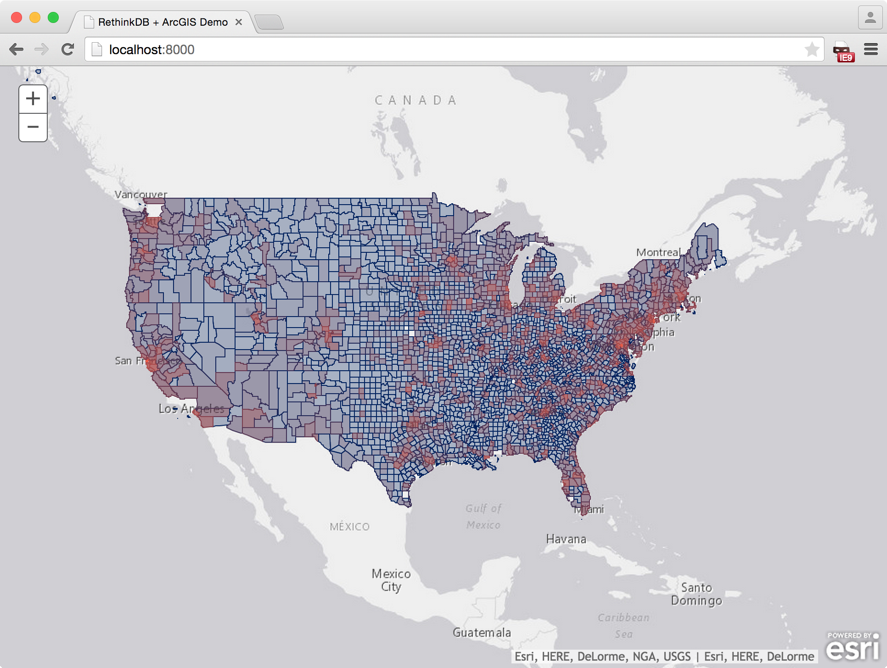
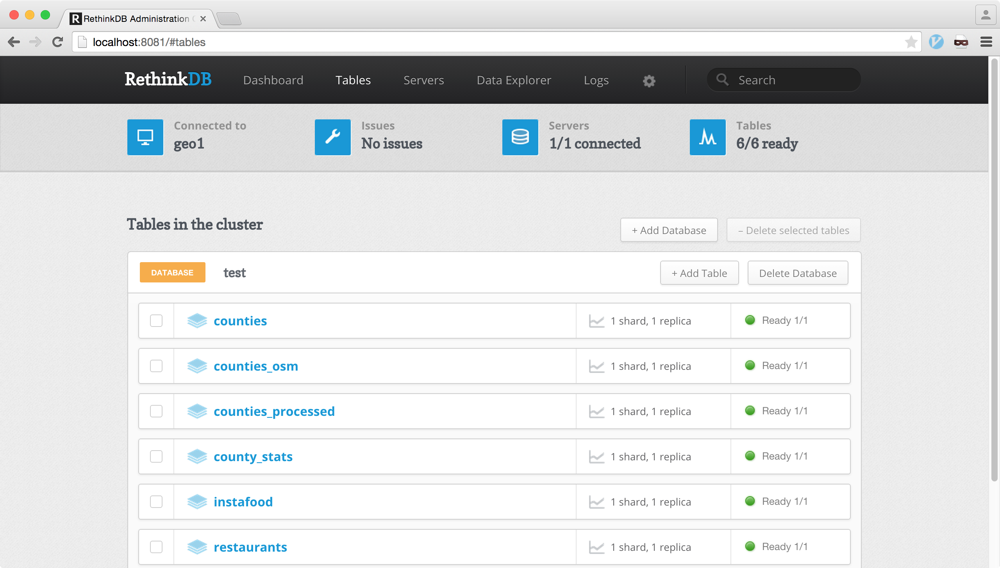

## RethinkDB + ArcGIS

A simple demo showing RethinkDB + ArcGIS's JavaScript API.



## Setup

#### Installing Node.js

If you're on a Mac, you can use homebrew to install [Node.js](https://nodejs.org/).

```
$ brew install node
```

Install all depdendencies

```
$ npm install
```

#### Installing RethinkDB

After installing node.js, you need to install RethinkDB:

If you're on a Mac, install it using homebrew:
```
$ brew install rethinkdb
```
Homebrew will give you some options about whether you want to run it on startup or not. 

After that, test whether RethinkDB is running by running the `rethinkdb` command and going to `localhost:8080`.

```
$ rethinkdb
```
When going to `localhost:8080`, you should see the web UI.


#### Importing Data

After installing, RethinkDB you now need to import the database with the census, restaurant, and processed data.

First, pull down the archive file with the database (this is stored in my servers).

```
$ curl -O http://thejsj.com/2015/arcgis/data-backup-latest.tar.gz
```
Then, extract it.

```
$ tar --extract --file=data-backup-latest.tar.gz
```

After extracting the tar, you can now run the database with the data specified

```
$ rethinkdb -d ./data-backup --port-offset 1
```
Once you're run this command, you can go to localhost:8081 (Notice that it's a different port!), and go to the `tables` table on the top. You should have the following tables.



## Running the app

In order to run the app, you need to do two things: 1. Run RethinkDB and 2. Run the development server.

1. Run RethinkDB with an 1 port offset and the data you downloaded.

```
$ rethinkdb -d ./data-backup --port-offset 1
```

2. Run development server

```
$ npm run dev
```
